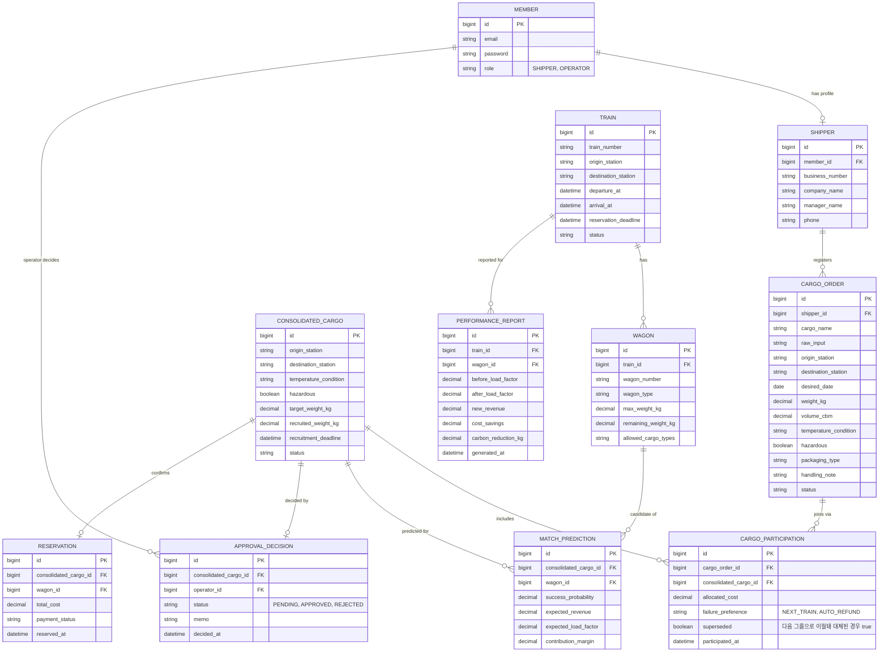

# 아키텍처 개요

## 기술 스택

| 영역 | 선택 | 비고 |
|---|---|---|
| 언어/런타임 | Java 17 (toolchain) | JDK 21로 빌드/실행 가능 |
| 프레임워크 | Spring Boot 4.1 (Spring Framework 7) | `spring-boot-starter-webmvc`, `-security`, `-data-jpa`, `-validation`, `-actuator` |
| DB | MySQL 8 | 로컬은 Docker Compose로 기동 |
| 마이그레이션 | Flyway | `backend/src/main/resources/db/migration` |
| 인증 | JWT (jjwt) + Spring Security | Role: `SHIPPER` / `OPERATOR` |
| API 문서 | springdoc-openapi | `/swagger-ui.html`, `/v3/api-docs` |
| LLM(화물 정보 구조화) | Google Gemini API (무료 등급, 선택) | `app.ai.provider=gemini` + `GEMINI_API_KEY` 설정 시 활성화, 미설정 시 규칙기반으로 자동 대체 |
| 최적화(최적 적재 조합) | Google OR-Tools CP-SAT | `com.google.ortools:ortools-java` |
| 스케줄링 | Spring `@Scheduled` | 모집 마감 경과 그룹을 5분마다 스윕(`ConsolidationFailureScheduler`) |
| 테스트 | JUnit5, Mockito, AssertJ, Testcontainers(MySQL) | 서비스/알고리즘 단위 테스트 + 통합 테스트 1종 |
| 인프라 | Docker Compose (MySQL + backend + Nginx) | OCI VM에서 HTTPS로 운영 배포 |
| 프론트엔드 | React 19 + Vite + TypeScript + Tailwind CSS 4 | 화주용 웹앱, `frontend/` (자세한 내용은 [frontend/README.md](../../frontend/README.md)) |
| CORS | Spring Security `CorsConfigurationSource` | 기본 허용 오리진 `http://localhost:5173` (`app.cors.allowed-origins`로 변경 가능) |

## 모노레포 구조

```
kolog-smart-mobility/
├── backend/            # Spring Boot 애플리케이션 (Gradle)
├── frontend/           # React + Vite + TS + Tailwind (화주용 웹앱)
├── infra/              # Docker Compose 등 로컬 인프라 설정
├── docs/
│   ├── planning/       # 기획안/기능명세 정리
│   └── architecture/   # 아키텍처/도메인 모델 문서
└── .github/workflows/  # CI
```

`backend`는 우선 단일 Gradle 모듈로 시작하고, 패키지를 도메인 단위(auth, shipper, cargo, train,
consolidation, matching, approval, reservation, report, operator)로 분리하는 패키지-바이-피처(package-by-feature)
구조를 사용한다. 각 도메인 패키지는 `domain / repository / service / controller / dto` 하위 구조를 갖는다.
추후 모듈이 커지면 Gradle multi-module로 분리한다.

## 도메인 모델 (ERD)



## AI/알고리즘 구현 방식

기능별로 실제 구현/규칙기반 여부가 다르다. 주요 구현 방식은 다음과 같다.

- **화물 정보 구조화** — `cargo.ai` 패키지. `GeminiCargoAiAnalysisService`(실제 LLM, 선택) 또는
  `RuleBasedCargoAiAnalysisService`(키워드/정규식 mock, 기본값)를 `app.ai.provider` 설정으로 전환한다.
  인터페이스는 `CargoAiAnalysisService`. Gemini 호출 실패 시 자동으로 규칙기반에 폴백한다.
- **최적 적재 조합** — `matching.optimization` 패키지. `LoadAssignmentSolver`가 OR-Tools CP-SAT로
  여러 공동화물↔여러 화차의 배정 문제를 실제로 푼다. `LoadOptimizationService`가 READY_FOR_MATCHING 상태의
  그룹들을 노선별로 모아 한 번에 최적화한다(그리디하게 하나씩 배정하는 것보다 전체 적재 효율이 높다).
- **모집 단계 성립확률** — `matching.simulation`/`matching.service` 패키지. `MonteCarloRecruitmentSimulationService`가
  노선별 최근 주문 도착 이력을 포아송 과정으로 가정하고 몬테카를로 시뮬레이션으로 마감 전 성립확률을 추정한다.
  이력이 부족하면(콜드스타트) 문서화된 가정값을 사용한다.
- **동적 가격** — `pricing` 패키지. `TieredDynamicPricingService`가 출발(모집마감) 임박도·모집률·성립확률에 따라
  T-24h/12h/6h/4h 단계별 할인율을 적용하고, 가격 하한 미만이면 참여 자체를 막는다.
- **배정 후 성립확률/수익성 점수화** — `MatchPredictionCalculator`. 위험물 여부만 반영하는 단순 규칙(mock)이다.

## 공동화 실패 처리

모집 마감이 지났는데 목표중량을 못 채웠거나(`ConsolidationService.handleExpiredRecruitingGroups`,
5분마다 실행되는 `ConsolidationFailureScheduler`), 코레일이 반려하면(`ApprovalService.reject`),
`ConsolidationService.processFailedGroup`이 참여자별로 미리 선택해둔 `FailurePreference`에 따라 처리한다.

- `NEXT_TRAIN`: 같은 노선의 다른 모집 그룹을 찾아(없으면 새로 열어) 참여를 이월한다. 기존 참여는
  `superseded=true`로 남겨 이력을 보존한다.
- `AUTO_REFUND`: 화물 주문을 취소 처리한다(가상 결제 단계라 실제 환불 연동은 없음).

기획안 보충이 제시한 "인접 거점 재매칭", "제휴 육상운송 전환", "추가요금 보장운송"은 인접 거점 마스터데이터·
육상운송사 연동이 없어 미구현이다.

## 동작 검증

`docker compose up`으로 MySQL + 백엔드를 띄운 뒤 회원가입 → 로그인 → 사업자 등록 → 화물 등록 → AI 분석 →
공동화물 추천/참여(목표중량 도달 시 자동 매칭) → 운영 대시보드 → 승인 → 예약/성과 리포트까지 전체 흐름을
실제 HTTP 요청으로 검증했다. 이 과정에서 발견해 수정한 이슈:

- `CargoOrder.rawInput`에 `@Lob`을 쓰면 Hibernate가 MySQL에서 `tinytext(CLOB)`를 기대해 Flyway가 만든
  `TEXT` 컬럼과 스키마 검증이 충돌했다. `@Lob` 대신 `columnDefinition = "TEXT"`로 명시해 해결.
- JDBC URL의 `serverTimezone=Asia/Seoul`이 컨테이너의 실제 UTC 시계와 어긋나 열차 조회 같은
  `LocalDateTime` 비교 쿼리가 조용히 빈 결과를 반환했다. `connectionTimeZone=SERVER`로 변경해,
  클라이언트가 타임존을 임의로 가정하지 않고 DB 서버의 실제 타임존을 따르도록 수정.
- Spring Security의 기본 인메모리 사용자 자동 구성(`UserDetailsServiceAutoConfiguration`)이 자체 JWT
  인증과 무관하게 매 기동마다 임의 비밀번호를 생성/로그로 남기고 있어 명시적으로 제외 처리.

AI/알고리즘 기능(Gemini 폴백, 몬테카를로 성립확률, OR-Tools 최적 배정, 동적 가격, 실패시 NEXT_TRAIN 재매칭 —
반려된 그룹의 화차 용량을 해제한 뒤 새 그룹에 재배정하는 것까지)도 같은 방식으로 실제 HTTP 요청으로 재검증했다.
이 과정에서 추가로 발견해 수정한 이슈:

- `GeminiClient`/`GeminiResponseParser`가 Spring이 관리하는 `ObjectMapper` 빈을 주입받으려 했는데,
  Boot 4의 웹 스택은 MVC 메시지 컨버터 내부에서만 Jackson을 구성하고 이를 별도 빈으로 노출하지 않아
  "No qualifying bean of type ObjectMapper" 오류로 기동 자체가 실패했다. 두 클래스 모두 전역 빈에
  기대지 않고 전용 `ObjectMapper` 인스턴스를 직접 생성하도록 수정.
